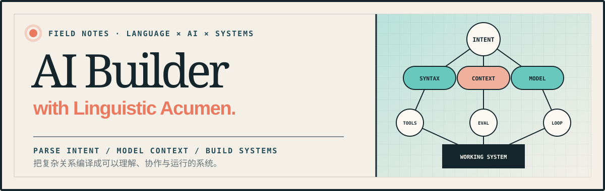

<p align="center">
  
</p>

<p align="center">
  <strong>AI Builder with Linguistic Acumen</strong><br/>
  <sub>I build agents, developer tools, and learning systems with a linguist's eye for structure and context.</sub>
</p>

<p align="center">
  <a href="https://caciniep.github.io/"></a>
  <a href="https://linguistwantstech.com/"></a>
  <a href="https://linguistwantstech.online/"></a>
  <a href="https://github.com/CacinieP?tab=followers"></a>
  <a href="./README.md"></a>
</p>

---

### `00 / AI AGENTS & EVALUATION`

**How do agents become reliable actors?**

I am exploring local-first tool use, agent evaluation, and self-evolution. The goal is not to make a model produce more expression, but to build systems that act reliably with limited context, explicit permissions, and real feedback.

`MAP CAPABILITY BOUNDARIES` → `DESIGN TOOL GRAMMARS` → `MEASURE TASK ENTROPY` → `CLOSE THE LOOP`

| PROJECT | PURPOSE | SIGNAL |
|---|---|---|
| [**TeXada**](https://github.com/CacinieP/TeXada-the-Math-Agent) | Natural language / LaTeX / formula screenshots in one verifiable math-writing flow. | [](https://github.com/CacinieP/TeXada-the-Math-Agent) |
| [**AgentEvalOps**](https://github.com/CacinieP/AgentEvalOps) | A front-end prototype for agent regression testing, drift detection, run comparison, and quality-analysis workflows. | [LIVE PROTOTYPE ↗](https://agent-bench-umber.vercel.app/) |
| [**SMAB**](https://github.com/CacinieP/SMAB) | An executable benchmark for small tool-using language models. | [](https://github.com/CacinieP/SMAB) |
| [**MiniCPM5 Network Doctor**](https://github.com/CacinieP/minicpm5-network-doctor) | A local-first, read-only network diagnostics agent powered by MiniCPM5 tool calling. | `LOCAL-FIRST` |
| [**agent-self-evolution**](https://github.com/CacinieP/agent-self-evolution) | Papers, reproductions, and prototypes for agent self-evolution. | `RESEARCH` |

### `01 / CREATOR & DEVELOPER TOOLS`

| PROJECT | PURPOSE | SIGNAL |
|---|---|---|
| [**video2knowledge**](https://github.com/CacinieP/video2knowledge) | Video → timestamped transcript → knowledge docs / HTML / Anki through local VLM and ASR paths. | [](https://github.com/CacinieP/video2knowledge) |
| [**slide-recipes**](https://github.com/CacinieP/slide-recipes) | Editable business PPTX for AI agents: 9 visual recipes, 20 semantic palettes, CJK-aware layout and render checks. | [](https://github.com/CacinieP/slide-recipes) |
| [**NetAssist**](https://github.com/CacinieP/NetAssist) | A Tauri + React desktop tool for network diagnostics, real-time monitoring, DNS queries, and port scanning. | [](https://github.com/CacinieP/NetAssist) |
| [**network-troubleshoot-skill**](https://github.com/CacinieP/network-troubleshoot-skill) | A universal network troubleshooting skill for AI coding agents. | [](https://github.com/CacinieP/network-troubleshoot-skill) · [Accepted](https://github.com/PatrickJS/awesome-cursorrules/pull/292) |
| [**FinancialBeancount**](https://github.com/CacinieP/FinancialBeancount) | Local conversion and deduplication for Alipay, WeChat Pay, and bank statements. | [](https://github.com/CacinieP/FinancialBeancount) · [Accepted](https://github.com/siddhantgoel/awesome-beancount/pull/76) |
| [**typing-master**](https://github.com/CacinieP/typing-master) | A multilingual typing-practice desktop app for six languages. | [](https://github.com/CacinieP/typing-master) |
| [**cace-timer**](https://github.com/CacinieP/cace-timer) | A local-first time-tracking CLI with marks, estimates, search, and sync. | [](https://github.com/CacinieP/cace-timer) |
| [**screenshot-auto-saver**](https://github.com/CacinieP/screenshot-auto-saver) | A Chrome extension for automatic webpage screenshots. | [](https://github.com/CacinieP/screenshot-auto-saver) |
| [**PyRecorder**](https://github.com/CacinieP/PyRecorder) | A lightweight Windows screen recorder built with Python. | [](https://github.com/CacinieP/PyRecorder) |

### `02 / SHIPPED & INTERACTIVE`

| PROJECT | EXPERIENCE | ACCESS |
|---|---|---|
| **SUSHI / 溯时** | A time-tracking experience designed for returning to past context. | [APP STORE ↗](https://apps.apple.com/app/id6779997923) |
| **Codetics** | An interactive narrative experiment about noise, compression, cognitive bias, and preserving meaning. | [**▶ PLAY NOW ↗**](https://codetics.vercel.app/) |
| [**MathConnect**](https://github.com/CacinieP/MathConnect) | A calculus connect puzzle for practicing equivalent infinitesimals. | [Play online ↗](https://caciniep.github.io/MathConnect/) · [](https://github.com/CacinieP/MathConnect) |
| [**FemaleFriendliness**](https://github.com/CacinieP/FemaleFriendliness) | An interactive self-assessment for female friendliness. | [](https://github.com/CacinieP/FemaleFriendliness) |
| [**resume**](https://github.com/CacinieP/resume) | My personal résumé website. | [View online ↗](https://caciniep.github.io/resume/) · [](https://github.com/CacinieP/resume) |

### `03 / KNOWLEDGE & RESEARCH`

| PROJECT | FOCUS | SIGNAL |
|---|---|---|
| [**CICPA-Learning**](https://github.com/CacinieP/CICPA-Learning) | An open-source 2026 CPA study guide with subject indexes and learning resources. | [](https://github.com/CacinieP/CICPA-Learning) |
| [**LPQE-Learning**](https://github.com/CacinieP/LPQE-Learning) | Study notes for China's Legal Professional Qualification Examination. | [](https://github.com/CacinieP/LPQE-Learning) |
| [**music-research**](https://github.com/CacinieP/music-research) | Notes on music understanding, generation, audio engineering, and edge deployment. | [](https://github.com/CacinieP/music-research) |
| [**linguistics-hackathon-S0-deutsch**](https://github.com/CacinieP/linguistics-hackathon-S0-deutsch) | A solo 48-hour, zero-to-A2 German linguistics hackathon. | [](https://github.com/CacinieP/linguistics-hackathon-S0-deutsch) |
| [**math-to-deep-learning**](https://github.com/CacinieP/math-to-deep-learning) | An applied-math path from paper derivations to GPU training. | `KNOWLEDGE SYSTEM` |
| [**Mathematics-Universe**](https://github.com/CacinieP/Mathematics-Universe) | A connected mathematics network from high school to graduate-level exams. | `KNOWLEDGE GRAPH` |

### `04 / LINGUISTIC EDGE`

> I bring linguistic training into AI building: parse the real intent, determine context boundaries, create a shared grammar for interfaces, and let feedback continuously correct the system.
>
> Language is not decoration after the interface. It is architecture before the system.

```
[ parse ] understand intent  →  [ model ] organize context  →  [ build ] make understanding run
```

| `SYNTAX / RELATIONS` | `CONTEXT / MEANING` | `INTERFACE / TRANSLATION` |
|---|---|---|
| Stabilize roles, dependencies, and actions so complexity remains understandable. | Meaning happens in context; reliability begins with preserving the right context. | An interface does not erase differences—it teaches different systems how to speak. |

### `05 / WORKING STACK`

`Python` `TypeScript` `JavaScript` `Swift` `Rust` `Kotlin`

`LLM Agents` `MCP` `Tool Use` `VLM / ASR` `Local-first AI` `Evaluation`

`React` `Astro` `Vite` `Tauri` `Electron` `GitHub Actions`

### `06 / OPEN-SOURCE IMPACT`

Substantive engineering and content contributions are ranked by upstream repository ⭐ and updated daily. Directory-listing contributions stay with their projects below instead of being repeated here:

<!-- START: oss-contributions -->
<!-- This block is auto-generated by .github/workflows/update-contributions.yml — do not edit by hand. -->
_9 merged PRs across 4 repos · auto-updated daily._

| Project | ★ | My merged PRs |
|---|---|---|
| [**rust**](https://github.com/rust-lang/rust) | [](https://github.com/rust-lang/rust) | [#160538](https://github.com/rust-lang/rust/pull/160538) — Update expect messages in tcp.rs doc examples to follow the style guide |
| [**agent-skills-with-anthropic**](https://github.com/datawhalechina/agent-skills-with-anthropic) | [](https://github.com/datawhalechina/agent-skills-with-anthropic) | [#1](https://github.com/datawhalechina/agent-skills-with-anthropic/pull/1) [#5](https://github.com/datawhalechina/agent-skills-with-anthropic/pull/5) [#8](https://github.com/datawhalechina/agent-skills-with-anthropic/pull/8) |
| [**video-devour**](https://github.com/datawhalechina/video-devour) | [](https://github.com/datawhalechina/video-devour) | [#24](https://github.com/datawhalechina/video-devour/pull/24) [#28](https://github.com/datawhalechina/video-devour/pull/28) [#29](https://github.com/datawhalechina/video-devour/pull/29) [#30](https://github.com/datawhalechina/video-devour/pull/30) |
| [**Step-Code**](https://github.com/stepfun-ai/Step-Code) | [](https://github.com/stepfun-ai/Step-Code) | [#16](https://github.com/stepfun-ai/Step-Code/pull/16) — test: add comprehensive test suite (848 tests, 11 files) |
<!-- END: oss-contributions -->

---

<p align="center">
  <a href="https://github.com/CacinieP?tab=repositories">ALL REPOSITORIES</a>
  &nbsp;·&nbsp;
  <a href="mailto:cacinie@gmail.com">EMAIL</a>
</p>

<p align="center">
  <sub>PARSE INTENT · MODEL CONTEXT · BUILD SYSTEMS</sub>
</p>
